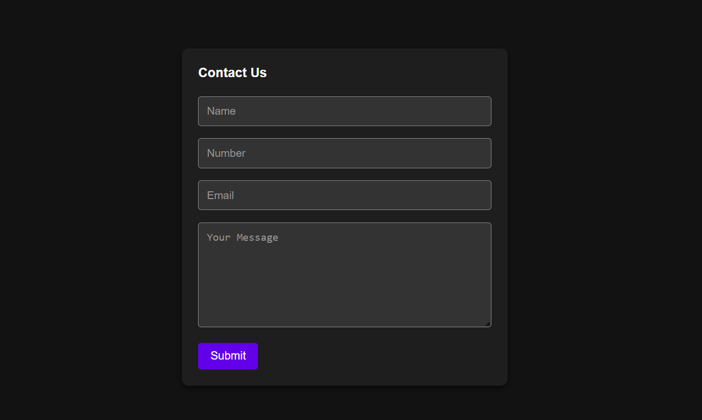

# Contact Form with Google Sheets Integration

## 🖥️ Description

This project features a contact form integrated with Google Sheets using Google Apps Script. The form captures user inputs and sends them directly to a Google Sheet for storage and management.

## 🚀 Features

- **Google Sheets Integration:** Submits form data directly to a Google Sheet.
- **Required Fields:** Ensures all fields are filled out before submission.
- **Error Handling:** Alerts users if there are validation errors or submission issues.

## 🔎 Technologies

This project was developed using the following technologies:

- **HTML and CSS:** For structuring and styling the web page.
- **JavaScript:** For client-side validation and interaction.
- **Google Apps Script:** For handling form submissions and interacting with Google Sheets.
- **Git and GitHub:** For version control and collaboration.